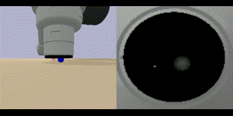

# Tactile-Gym: RL suite for tactile robotics 
[](LICENSE)

<!-- [Project Website](https://sites.google.com/my.bristol.ac.uk/tactile-gym-sim2real/home) &nbsp;&nbsp;• -->
**Tactile Gym 2.0**: [Project Website](https://sites.google.com/my.bristol.ac.uk/tactilegym2/home) &nbsp;&nbsp;•&nbsp;&nbsp;[Paper](https://ieeexplore.ieee.org/abstract/document/9847020)

**Tactile Gym 1.0**: [Project Website](https://sites.google.com/my.bristol.ac.uk/tactile-gym-sim2real/home) &nbsp;&nbsp;•&nbsp;&nbsp;[Paper](http://arxiv.org/abs/2106.08796)

This repo contains a suite of reinfocement learning environments built on top of [Tactile Sim](https://github.com/dexterousrobot/tactile_sim). These environments use tactile data as the main form of observations when solving tasks. This can be paired with [Tactile Sim2Real](https://github.com/dexterousrobot/tactile_sim2real) domain adaption for transferring learned policies to the real world.

<p align="center">
  
   <br>
  
  
  
</p>

This repo refers to the paper "*Sim-to-real Deep Reinforcement Learning for Comparing Low-cost High-Resolution Robot Touch*". If you find it useful for your research, please cite our paper.

### Content ###
- [Installation](#installation)
- [Testing Environments](#testing-environments)
- [Tactile Robot Environment Details](#tactile-robot-environment-details)
- [Observation Details](#observation-details)
- [Training Agents](#training-agents)
- [Re-training Agents](#re-training-agents)
- [Pretrained Agents](#pretrained-agents)
- [Alternate Robot Arms](#preliminary-support-for-alternate-robot-arms)
- [Additional Info](#additional-info)


### Installation ###
This repo has only been developed and tested with Ubuntu 18.04 and python 3.8.

```console
git clone https://github.com/dexterousrobot/tactile_gym
cd tactile_gym
pip install -e .
```

Demonstration files are provided in the example directory. From the base directory run

```
python examples/demo_env.py -env example_arm-v0
```

alternate envs can be specified but setting the `-env` argurment to any of the following: `example_arm-v0` `edge_follow-v0` `surface_follow-v0` `object_roll-v0` `object_push-v0` `object_balance-v0`.

Usage: You can specify a desired robot arm and a tactile sensor and other environment parameters within the `demo_env.py` file.

### Environment Details ###

| **Env. Name** | Description |
| :---: | :--- |
| `edge_follow-v0` | <ul><li>A flat edge is randomly orientated through 360 degrees and placed within the environment. </li><li>The sensor is initialised to contact a random level of pentration at the start of the edge.</li><li>The objective is to traverse the edge to a goal at the oposing end whilst maintaining that the edge is located centrally on the sensor.</li></ul>  |
| `surface_follow-v0`   | <ul><li>A terrain like surface is generated through [OpenSimplex Noise](https://pypi.org/project/opensimplex/).</li><li>The sensor is initialised in the center, touching the surface.</li><li>A goal is randomly placed towards the edges of the surface.</li><li>The objective is to maintain a normal orientation to the surface and a set penetration distance whilst the sensor is automatically moved towards the goal.</li></ul> |
| `surface_follow-v1`   | <ul><li>Same as `-v0` however the goal location is included in the observation and the agent must additionally learn to traverse towards the goal.</li></ul> |
| `surface_follow-v2`   | <ul><li>Same as `-v0` but verticalized, and this is used for training 4-DoF robots (MG400, Magician) which only have x-, y-, z-, and Rz-axes actuated.</li></ul> |
| `object_roll-v0`   | <ul><li>A small spherical object of random size is placed on the table.</li><li>A flat tactile sensor is initialised to touch the object at a random location relative to the sensor.</li><li>A goal location is generated in the sensor frame.</li><li>The objective is to manipulate the object to the goal location.</li></ul> |
| `object_push-v0`   | <ul><li>A cube object is placed on the table and the sensor is initialised to touch the object (in a right-angle configuration).</li><li>A trajectory of points is generated through OpenSimplex Noise.</li><li>The objective is to push the object along the trajectory, when the current target point has been reached it is incremented along the trajectory until no points are left.</li></ul> |
| `object_balance-v0`   | <ul><li>Similar to a 2d CartPole environment.</li><li>An unstable pole object is balanced on the tip of a sensor pointing upwards.</li><li>A random force pertubation is applied to the object to cause instability.</li><li>The objective is to learn planar actions to counteract the rotation of the object and mantain its balanced position.</li></ul> |


### Observation Details ###

All environments contain 4 main modes of observation:

| Observation Type | Description |
| :---: | :--- |
| `oracle` | Comprises ideal state information from the simulator, which is difficult information to collect in the real world, we use this to give baseline performance for a task. The information in this state varies between environments but commonly includes TCP pose, TCP velocity, goal locations and the current state of the environment. This observation requires signifcantly less compute both to generate data and for training agent networks.|
| `tactile` | Comprises images (default 128x128) retrieved from the simulated optical tactile sensor attached to the end effector of the robot arm (Env Figures right). Where tactile information alone is not sufficient to solve a task, this observation can be extended with oracle information retrieved from the simulator. This should only include information that could be be easily and accurately captured in the real world, such as the TCP pose that is available on industrial robotic arms and the goal pose. |
| `visual` | Comprises RGB images (default 128x128) retrieved from a static, simulated camera viewing the environment (Env Figures left). Currently, only a single camera is used, although this could be extended to multiple cameras. |
| `visuotactile` |  Combines the RGB visual and tactile image observations to into a 4-channel RGBT image. This case demonstrates a simple method of multi-modal sensing. |

When additional information is required to solve a task, such as goal locations, appending `_and_feature` to the observation name will return the complete observation.


### Training Agents ###

The environments use the [OpenAI Gym](https://gym.openai.com/) interface so should be compatible with most reinforcement learning librarys.

We use [stable-baselines3](https://github.com/DLR-RM/stable-baselines3) for all training, helper scripts are provided in `tactile_gym/sb3_helpers/`

A simple experiment can be run with `simple_sb3_example.py`, a full training script can be run with `train_agent.py`. Experiment hyper-params are in the `parameters` directory.


### Bibtex ###
```
@InProceedings{lin2022tactilegym2,
     title={Tactile Gym 2.0: Sim-to-real Deep Reinforcement Learning for Comparing Low-cost High-Resolution Robot Touch},
     author={Yijiong Lin and John Lloyd and Alex Church and Nathan F. Lepora},
     journal={IEEE Robotics and Automation Letters},
     year={2022},
     volume={7},
     number={4},
     pages={10754-10761},
     editor={R. Liu A.Banerjee},
     series={Proceedings of Machine Learning Research},
     month={August},
     publisher={IEEE},
     doi={10.1109/LRA.2022.3195195}}
     url={https://ieeexplore.ieee.org/abstract/document/9847020},
}

@InProceedings{church2021optical,
     title={Tactile Sim-to-Real Policy Transfer via Real-to-Sim Image Translation},
     author={Church, Alex and Lloyd, John and Hadsell, Raia and Lepora, Nathan F.},
     booktitle={Proceedings of the 5th Conference on Robot Learning},
     year={2022},
     editor={Faust, Aleksandra and Hsu, David and Neumann, Gerhard},
     volume={164},
     series={Proceedings of Machine Learning Research},
     month={08--11 Nov},
     publisher={PMLR},
     pdf={https://proceedings.mlr.press/v164/church22a/church22a.pdf},
     url={https://proceedings.mlr.press/v164/church22a.html},
}
```
